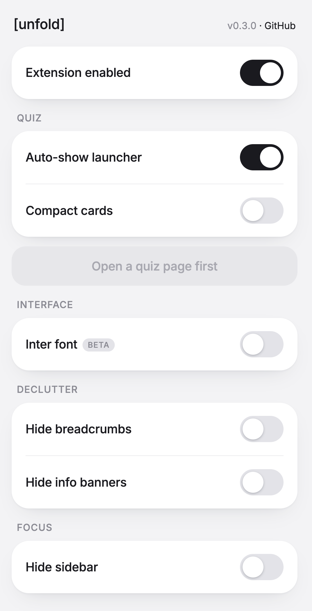

<p align="center">
  
</p>

<h1 align="center">[unfold]</h1>

<p align="center">
  Declutter the IITM Online Degree portal.
</p>

<p align="center">
  <b><a href="../../releases/latest">Download the latest release</a></b>
</p>

<p align="center">
  <a href="https://github.com/civiks/unfold-iitm/actions/workflows/ci.yml"></a>
  <a href="../../releases"></a>
  <a href="LICENSE"></a>
</p>

<p align="center">
  <sub>Unofficial, beta, not affiliated with IIT Madras. <a href="NAMING.md">Why "[unfold]"?</a></sub>
</p>

<p align="center">
  
</p>

## Features

- Unfold a quiz into a single scrollable sheet
- Print or save a quiz as PDF
- Inter font
- Hide sidebar, breadcrumbs, info banners
- Compact mode
- Master on/off toggle

## Install

Not on the Chrome/Firefox stores yet. Install it manually:

1. Download the zip from [Releases](../../releases/latest).
2. Unzip it.
3. Open `chrome://extensions`, turn on "Developer mode" (top right).
4. Click "Load unpacked" and select the unzipped folder.

On Firefox: open `about:debugging`, click "Load Temporary Add-on", and pick `manifest.json` from the unzipped folder.

No install needed? Open `bookmarklet/install.html` and drag the button to your bookmarks bar.

## Build

There's no bundler. The logic lives in `bookmarklet/bookmarklet-source.js`, and the build copies it into `build/run.js` and regenerates the bookmarklet files:

```bash
node build.mjs
```

Full dev and release guide: [CONTRIBUTING](.github/CONTRIBUTING.md).

## How it works

The portal shows one question at a time and owns the form state, so the sheet is a mirror. It snapshots each question and replays your answers on the live form, flushing autosave by navigating away. Prompts are captured from the rendered HTML, so math stays intact.

## Disclaimer

Beta and unofficial. It reads and replays answers on the live quiz form, so verify everything saved on the original quiz before submitting. Not affiliated with IIT Madras; "IITM" only describes what it works with.

## License

[MIT](LICENSE)
